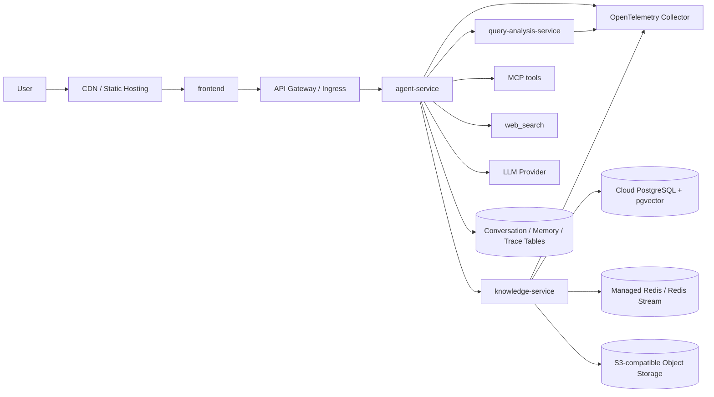
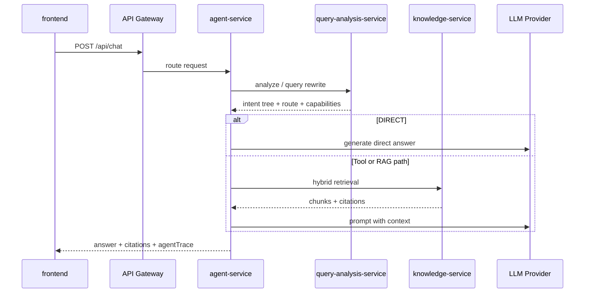
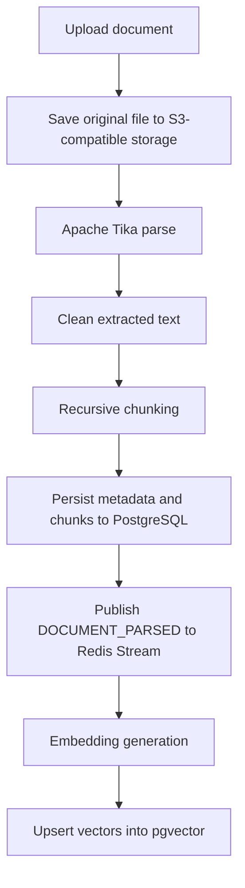

# RAG Agent

版本：`1.2.0-dev`

这是一个面向云端部署的 RAG Agent 系统，覆盖知识库管理、查询分析、Agent 编排、工具调用、会话记忆、MCP 管理、可观测性和前端交互。项目目标不是停留在“向量检索 Demo”，而是把文档入库、混合检索、意图路由、工具调度、答案生成、引用追踪和运行观测组织成一条完整的生产型问答链路。

普通问答入口是 `agent-service` 的 `/api/chat` 和 `/api/chat/stream`。请求进入后会先经过 `query-analysis-service` 做意图识别、路由建议和 query rewrite，再由 Spring AI Alibaba `StateGraph` 决定直接回答、调用工具或检索知识库，最终通过 LLM 生成带引用和 `agentTrace` 的回答。`/api/chat/multi-agent` 使用同一运行时的并行 Agent 图，普通与 multi-agent 路径不再维护两套编排实现。

## 核心能力

- 知识库管理：支持知识库创建、文档上传、解析、chunk、索引、检索和删除。
- 混合检索：支持 pgvector 向量检索、BM25 稀疏检索、multi-query expansion 和 RRF 排名融合。
- 查询分析：独立 query 分析服务输出 `requestType`、`route`、`executionMode`、`requiredCapabilities` 和 `clarificationQuestion`。
- Agent 编排：`agent-service` 使用 Spring AI Alibaba Agent Framework / StateGraph 实现状态、路由、并行能力节点、答案生成和反思条件循环。
- 工具接入：内置 `rag_retrieval`、`web_search`、`mcp_tool` 等工具能力，并支持 MCP `stdio` / `streamable_http` 服务管理。
- 会话能力：支持会话历史、短期上下文、滚动摘要、结构化状态、长期语义记忆和用户画像事实。
- 流式交互：前端和后端支持 SSE 流式回答、Trace 增量、引用返回和错误事件。
- 可观测性：同时提供 OpenTelemetry 分布式链路追踪和业务级 `AgentTrace`。
- 云端部署：服务可拆分部署为多个容器或工作负载，依赖云数据库、Redis、对象存储、观测平台和外部 LLM 服务。

## 系统架构



四个核心模块的职责边界：

| 模块 | 职责 | 部署形态 |
| --- | --- | --- |
| `frontend/` | React 19 + TypeScript + Vite 前端，负责聊天、知识库、引用、会话、MCP 管理和流式展示 | 静态站点、对象存储 + CDN、或前端容器 |
| `agent-service/` | 生产 RAG Agent 入口，使用 Spring AI Alibaba 图统一负责 `/api/chat`、工具调用、MCP、记忆、Trace、反馈和 multi-agent 入口 | 独立后端服务，建议横向扩容 |
| `query-analysis-service/` | 第一层查询分析网关，负责意图识别、路由建议、执行模式判断、query rewrite 和多检索查询生成 | 独立后端服务，可按 LLM 调用压力扩容 |
| `knowledge-service/` | 知识库存储与检索底座，负责文档解析、chunk、对象存储、元数据、向量索引、BM25 和 hybrid retrieval | 独立后端服务，连接数据库、Redis 和对象存储 |

## 主请求链路

普通 `/api/chat` 是当前生产主链路：



链路中的关键设计：

- `query-analysis-service` 是第一层路由与改写网关，不直接访问知识库，也不生成最终答案。
- `agent-service` 是编排中心，负责消费意图树、选择执行模式、调度工具、组织 Prompt、调用 LLM 和持久化 Trace。
- `knowledge-service` 只负责知识库、文档处理、索引和检索，不承担会话管理或最终回答生成。
- 前端不直连数据库、Redis、对象存储或 pgvector，所有能力都通过 API Gateway / Ingress 暴露。

## Spring AI Alibaba Agent 图编排

普通 `/api/chat`、流式 `/api/chat/stream` 和显式 multi-agent 入口统一由 `SpringAiAlibabaAgentRuntime` 承载。HTTP 层只保留薄的 `ChatOrchestrator` 门面，Agent 状态、节点执行、条件边和并行分支全部运行在 Spring AI Alibaba `StateGraph` 上。

普通问答图的核心流程是：

```txt
prepare_context
  -> query_analysis
  -> route_capabilities
  -> execute_capability
  -> generate_answer
  -> reflect_answer -- retry --> generate_answer
  -> finalize_response
```

显式 multi-agent 图在 `route_capabilities` 后并行扇出：

```txt
route_capabilities
  ├─> knowledge_agent ─┐
  ├─> web_search_agent ├─> generate_answer -> reflect_answer -> finalize_response
  └─> mcp_tool_agent ──┘
```

各节点职责：

- `prepare_context`：加载会话记忆并构造分析视图与回答视图。
- `query_analysis`：调用 `query-analysis-service`，失败时在图节点内回退。
- `route_capabilities`：根据 `requiredCapabilities` 和实时/MCP 路由结果选择图分支。
- `knowledge_agent`、`web_search_agent`、`mcp_tool_agent`：执行对应业务能力并回写观察结果。
- `generate_answer` 与 `reflect_answer`：生成答案，并通过条件边完成有上限的反思重试。
- `finalize_response`：组装引用、`agentTrace`、OpenTelemetry 标识并写入会话与 Trace 存储。

当前 specialist agent 的边界：

| Agent | 能力边界 | 典型场景 |
| --- | --- | --- |
| Knowledge Agent | 调用 `knowledge-service` 做知识库检索 | 业务资料、上传文档、内部知识问答 |
| WebSearch Agent | 调用 `web_search` 工具获取实时信息 | 新闻、价格、天气、当前状态类问题 |
| MCP Tool Agent | 调用已启用的 MCP 工具 | 外部系统查询、企业工具调用、协议化工具任务 |
| FollowUp Agent | 处理澄清和追问 | 信息不足、意图不完整、需要用户补充条件 |

A2A 外部协议入口由 Spring AI Alibaba A2A Starter 提供。项目侧的 `AgentExecutor` 直接委托统一图运行时，任务查询与取消使用 A2A JSON-RPC 方法 `tasks/get` 和 `tasks/cancel`。项目不维护自写 A2A Controller、REST task facade 或自建 A2A runtime 回退实现。

## 文档入库与检索链路

文档上传后会进入异步索引流程：



检索默认使用 `hybrid` 模式：

```txt
user query
  -> query rewrite / multi-query expansion
  -> dense retrieval: embedding + pgvector
  -> sparse retrieval: BM25
  -> ranking fusion: RRF
  -> chunks + metadata + citations
```

`vector` 更适合语义相似问题，`bm25` 更适合精确词、编号、型号和专有名词，`hybrid` 通过 RRF 融合两类结果，是当前默认检索基线。

## 云端部署拓扑

推荐按服务边界拆分部署：

```txt
Internet
  -> CDN / Static Hosting
  -> API Gateway / Ingress
      -> agent-service
          -> query-analysis-service
          -> knowledge-service
          -> LLM Provider
          -> MCP / Web Search
      -> knowledge-service document APIs

Managed dependencies
  -> PostgreSQL with pgvector
  -> Redis or Redis-compatible service
  -> S3-compatible object storage
  -> OpenTelemetry Collector / APM backend
```

部署建议：

- 前端构建后放到 CDN、对象存储静态站点或 Nginx 容器，运行时通过 API Gateway 访问后端。
- 三个后端服务分别构建镜像部署，服务之间使用内网域名通信，例如 `http://agent-service:28083`、`http://query-analysis-service:28082`、`http://knowledge-service:28081`。
- PostgreSQL 需要启用 pgvector 扩展；向量、文档元数据、会话、反馈和 Trace 表建议统一放在云数据库中管理。
- Redis 用于文档处理事件和可选会话记忆后端，生产环境建议使用托管 Redis 或具备持久化和监控能力的 Redis 集群。
- 原始文档建议放在 S3 兼容对象存储中，开发环境可使用 RustFS，云端可替换为云厂商对象存储或企业内部 S3 服务。
- 外部 LLM、Embedding、Web Search 和 MCP 服务通过环境变量或配置中心注入，不应写死在代码或镜像中。
- OpenTelemetry Trace 建议统一上报到 Collector，再转发到 Jaeger、Tempo、SkyWalking、Datadog、云厂商 APM 等后端。

## 技术选型

| 方向 | 技术 | 选择原因 |
| --- | --- | --- |
| 后端框架 | Java 17 + Spring Boot | 适合拆分服务、REST API、配置管理、测试和企业级工程结构 |
| Agent 编排 | Spring AI Alibaba Agent Framework / StateGraph | 普通与 multi-agent 链路统一使用图状态、条件边、并行分支和反思循环 |
| 查询分析 | 独立 `query-analysis-service` | 将意图识别、路由、query rewrite 从 Agent 编排中拆出，便于调试和替换策略 |
| 文档解析 | Apache Tika | 支持多格式文本抽取，适合作为知识库入库基础能力 |
| 元数据存储 | PostgreSQL | 文档、chunk、会话、反馈和 Trace 都需要结构化查询与事务一致性 |
| 向量检索 | pgvector | 向量和元数据在同一数据库内，便于删除、重建索引和一致性维护 |
| 稀疏检索 | BM25 | 弥补纯向量检索对精确关键词、数字、型号和术语召回不稳定的问题 |
| 排名融合 | RRF | 将向量结果和 BM25 结果做稳定融合，降低单一检索器偏差 |
| 对象存储 | S3-compatible storage / RustFS | 原始文件独立存放，Java 侧通过 S3 兼容协议访问 |
| 异步处理 | Redis Stream | 文档解析完成后通过事件驱动索引，避免上传请求阻塞向量化流程 |
| 工具协议 | MCP Java SDK | 支持 `stdio` 和 `streamable_http` 工具服务接入，便于扩展外部能力 |
| 可观测性 | Micrometer Tracing + OpenTelemetry | 统一后端服务间 trace，上报 HTTP、下游调用、耗时和错误 |
| 前端 | React 19 + TypeScript + Vite | 适合构建交互式 Agent 工作台，开发反馈快，类型约束明确 |

## 模块说明

### frontend

`frontend/` 是用户交互层，主要能力包括：

- 聊天输入、流式回答和错误状态展示。
- 会话列表、会话恢复、置顶、归档和消息历史。
- 知识库管理、文档上传、索引状态和检索配置。
- 引用、检索片段、调试信息和 `agentTrace` 展示。
- MCP 服务配置、工具刷新和单工具测试调用。

部署时执行构建命令，并将产物发布到静态站点、CDN 或前端容器：

```bash
cd frontend
npm install
npm run build
```

### agent-service

`agent-service/` 是生产问答编排服务，负责：

- `/api/chat` 和 `/api/chat/stream`。
- 消费 query analysis 的意图树。
- 将 `DIRECT`、`SINGLE_TOOL`、`ITERATIVE_TOOL`、`PLANNED_TASK` 映射为 Spring AI Alibaba 图节点与分支。
- 通过图节点调用 `rag_retrieval`、`web_search`、`mcp_tool` 业务能力。
- 管理会话历史、会话记忆、长期语义记忆和用户画像事实。
- 持久化 `AgentTrace`、反馈记录和会话消息。
- 暴露统一 Spring AI Alibaba 普通与 multi-agent 运行入口。

服务需要连接 `query-analysis-service`、`knowledge-service`、PostgreSQL、Redis、LLM Provider、MCP 服务和观测后端。

### query-analysis-service

`query-analysis-service/` 是查询理解与改写服务，负责：

- `/api/chat/analyze` 和 `/api/chat/query-rewrite`。
- 使用 LLM JSON 分类器输出意图树。
- LLM 未配置、调用失败或 JSON 不合法时回退到规则分类。
- 为知识库问题生成 `rewrittenQuery` 和 `retrievalQueries`。
- 为工具型问题输出 `requiredCapabilities`。
- 为低置信度或信息不足的问题输出 `clarificationQuestion`。

该服务可以按 LLM 调用量单独扩容，也可以独立替换分类、改写或路由策略。

### knowledge-service

`knowledge-service/` 是知识库底座，负责：

- 知识库和文档 API。
- S3 兼容对象存储中的原文管理。
- Apache Tika 文档解析。
- 文本清洗、recursive chunk 和 chunk 元数据。
- PostgreSQL 元数据持久化。
- Redis Stream 文档处理事件。
- embedding、pgvector、BM25 和 hybrid retrieval。

生产部署时需要重点关注文档解析资源、Embedding 调用吞吐、数据库连接池、对象存储权限和索引重建任务隔离。

## 部署配置

主要配置文件：

```txt
knowledge-service/src/main/resources/application.yml
query-analysis-service/src/main/resources/application.yml
agent-service/src/main/resources/application.yml
frontend/vite.config.ts
```

推荐通过环境变量、配置中心或 Secret Manager 注入以下配置：

```txt
ARK_API_KEY
RAG_LLM_OPENAI_COMPATIBLE_BASE_URL
RAG_LLM_ANTHROPIC_COMPATIBLE_BASE_URL
POSTGRES_HOST
POSTGRES_PORT
POSTGRES_DATABASE
POSTGRES_USERNAME
POSTGRES_PASSWORD
REDIS_HOST
REDIS_PORT
S3_ENDPOINT
S3_ACCESS_KEY
S3_SECRET_KEY
S3_BUCKET
QUERY_ANALYSIS_BASE_URL
KNOWLEDGE_SERVICE_BASE_URL
OTEL_EXPORTER_OTLP_TRACES_ENDPOINT
OTEL_TRACES_SAMPLER_PROBABILITY
```

配置原则：

- 密钥、Token、数据库密码和 LLM Key 必须放在云端 Secret Manager、Kubernetes Secret 或 CI/CD 变量中。
- 后端服务之间使用内网地址，不建议通过公网互相访问。
- 对象存储 Bucket 权限应按最小权限分配，只允许服务读写项目需要的路径。
- API Gateway / Ingress 负责 TLS、跨域、认证、限流和路由。
- SSE 流式接口需要网关关闭不合适的响应缓冲，并配置足够的超时时间。
- 不要提交真实密钥、运行日志、`.codex-run/`、`target/`、`dist/`、`node_modules/`、`knowledge-service/data/` 或 `knowledge-service/tmp/`。

## API 概览

### Agent API

```txt
POST /api/chat
POST /api/chat/stream
POST /api/chat/multi-agent
POST /api/chat/multi-agent/stream
GET  /api/chat/multi-agent/agents
```

A2A 外部协议入口由 Spring AI Alibaba A2A Starter 提供，项目侧 `AgentExecutor` 直接调用 `ChatOrchestrator` 背后的统一图运行时。任务查询与取消使用 A2A JSON-RPC 方法 `tasks/get` 和 `tasks/cancel`，不维护项目自写 A2A Controller 或 REST task facade：

```txt
POST /api/chat/multi-agent/a2a
GET  /.well-known/agent.json
```

### Conversation / MCP / Trace / Feedback

```txt
GET    /api/conversations
POST   /api/conversations
GET    /api/conversations/{id}
GET    /api/conversations/{id}/messages
PATCH  /api/conversations/{id}
DELETE /api/conversations/{id}

GET    /api/mcp/servers
POST   /api/mcp/servers
PUT    /api/mcp/servers/{id}
DELETE /api/mcp/servers/{id}
POST   /api/mcp/servers/{id}/refresh
POST   /api/mcp/servers/{id}/tools/{toolName}/call

GET    /api/traces/{traceId}
GET    /api/traces?conversationId={conversationId}&limit=50
POST   /api/feedback
GET    /api/feedback?conversationId={conversationId}&limit=50
```

### Knowledge API

```txt
GET    /api/knowledge-bases
POST   /api/knowledge-bases
GET    /api/knowledge-bases/{id}/documents
POST   /api/knowledge-bases/{id}/documents
GET    /api/knowledge-bases/{id}/documents/{documentId}
GET    /api/knowledge-bases/{id}/documents/{documentId}/chunks
POST   /api/knowledge-bases/{id}/documents/{documentId}/reparse
POST   /api/knowledge-bases/{id}/documents/{documentId}/reindex
DELETE /api/knowledge-bases/{id}/documents/{documentId}
POST   /api/vector/search
GET    /api/vector/status
```

### Query Analysis API

```txt
POST /api/chat/analyze
POST /api/chat/query-rewrite
```

## 流式事件

`/api/chat/stream` 使用 SSE 返回增量事件：

```txt
metadata
trace_delta
answer_delta
answer_reset
citations
done
error
```

前端据此分离展示回答文本、Trace 步骤、引用和错误状态。云端部署时，网关、负载均衡和反向代理需要支持长连接与流式响应。

## 可观测性

后端服务接入 Micrometer Tracing 和 OpenTelemetry bridge：

- HTTP 响应暴露 `X-Trace-Id` 和 `X-Span-Id`。
- 服务间 `RestClient` 调用传播 W3C `traceparent`。
- 通过 `OTEL_EXPORTER_OTLP_TRACES_ENDPOINT` 指向云端或集群内 OpenTelemetry Collector。
- Trace 后端可选择 Jaeger、Tempo、SkyWalking、Datadog、Grafana Cloud 或云厂商 APM。

`OpenTelemetry Trace` 和 `AgentTrace` 的定位不同：

| 类型 | 关注点 | 用途 |
| --- | --- | --- |
| OpenTelemetry Trace | HTTP、下游调用、耗时、异常、跨服务传播 | 排查基础设施链路和性能问题 |
| AgentTrace | 图节点、意图路由、能力观察、检索结果、答案生成、反思重试 | 解释 Agent 为什么这样回答 |

## 项目亮点

- 从检索 Demo 演进为完整 RAG Agent 系统，职责拆分清晰，适合按云端服务边界独立部署。
- 查询分析独立成服务，便于调试意图识别、路由和 query rewrite。
- 检索侧同时覆盖语义召回和关键词召回，并通过 RRF 做结果融合。
- Agent 侧通过 Spring AI Alibaba 图节点统一调度 MCP、联网搜索和知识库检索能力。
- 会话历史、记忆、Trace、反馈和 MCP 管理都由 `agent-service` 统一承接，前端只负责交互。
- 可观测性同时覆盖基础设施调用链和 Agent 决策链，便于定位“慢在哪里”和“为什么这样答”。

## Roadmap

- 补充云端部署文档、容器镜像构建说明和 Kubernetes / Docker Compose 示例。
- 增加端到端演示脚本和 mock LLM 联调模式。
- 完善检索评测集和 RAGAS / 自定义指标评测流程。
- 为 MCP 工具调用增加更完整的权限、审计和失败恢复策略。
- 根据真实业务数据继续优化 chunk 策略、rerank 和答案引用质量。
