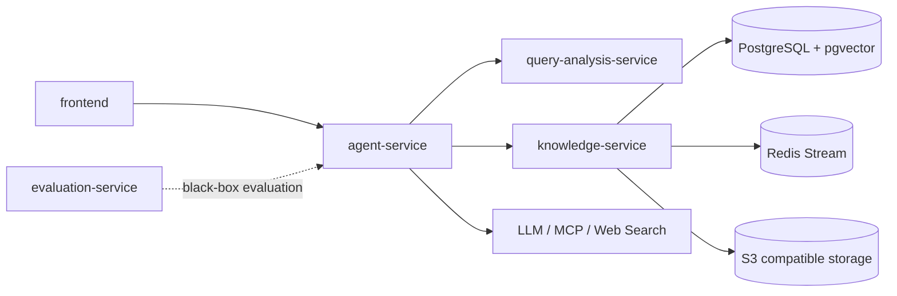

# RAG Agent Platform

面向知识库问答的可独立部署 RAG 平台。它把查询理解、Agent 编排和知识库检索拆为清晰的服务边界，而不是把全部逻辑堆在单一应用中。

## 架构与边界



| 模块 | 责任 | 不负责 |
| --- | --- | --- |
| `frontend/` | 聊天、SSE 展示、会话、知识库与 MCP 管理界面 | 直接连接存储或调用模型 |
| `agent-service/` | Chat 入口、图编排、工具策略、记忆、Trace、反馈 | 文档解析与索引实现 |
| `query-analysis-service/` | 意图识别、路由建议、查询改写、澄清建议 | 调工具、检索或生成最终答案 |
| `knowledge-service/` | 文档、chunk、索引、向量/BM25/hybrid 检索 | 会话与 Prompt 编排 |
| `evaluation-service/` | 离线/准在线评测、确定性指标与可选 RAGAS | 生产请求链路 |

跨服务只通过 HTTP/OpenAPI 契约通信；不要通过复制 Java 业务 DTO 绕过契约。详细边界和端口见 [MODULES.md](MODULES.md)，同步契约见 [docs/contracts](docs/contracts/README.md)。

## 主要请求链路

普通用户问答走 `/api/chat`：

```text
frontend -> agent-service -> query-analysis-service
         -> (按策略选择 knowledge-service / web_search / MCP)
         -> LLM -> answer + citations + agentTrace
```

`agent-service` 中普通问答和显式 multi-agent 问答都由 `SpringAiAlibabaAgentRuntime` 承载：普通图只选择一个能力分支，multi-agent 图才并行执行多个能力分支。

## 本地开发

前置条件：Java 17、Maven 3.9+、Node.js 20+、Python 3.10+（仅评测模块）。

```powershell
# 统一编译三个 Java 服务；不会启动任何外部依赖。
mvn verify
```

```powershell
cd knowledge-service
docker compose up -d
mvn spring-boot:run
```

另开终端，依次启动：

```powershell
cd query-analysis-service
mvn spring-boot:run
```

```powershell
cd agent-service
mvn spring-boot:run
```

```powershell
cd frontend
npm install
npm run dev
```

默认端口：知识库 `28081`、查询分析 `28082`、Agent `28083`、前端 `5173`、评测 API（可选）`28084`。

## 验证

```powershell
mvn test

cd frontend
npm run lint
npm run build
npm run test
```

涉及路由、检索或工具调用的修改还应在服务启动后做一次真实链路验证；单元测试不能替代外部服务、模型和配置组合的验证。

## 配置与安全

各服务配置位于对应模块的 `src/main/resources/application.yml`。密钥和本地覆盖配置通过环境变量或 `application-local.yml` 注入，常用变量包括：

```text
ARK_API_KEY
QUERY_ANALYSIS_BASE_URL
KNOWLEDGE_SERVICE_BASE_URL
POSTGRES_HOST / POSTGRES_PORT / POSTGRES_USERNAME / POSTGRES_PASSWORD
REDIS_HOST / REDIS_PORT
S3_ENDPOINT / S3_ACCESS_KEY / S3_SECRET_KEY
OTEL_EXPORTER_OTLP_TRACES_ENDPOINT
```

不要提交 API Key、日志、运行目录、构建产物或本地数据。`.gitignore` 只排除运行产物；源码、测试和 Markdown 文档应保持可追踪。

## 文档入口

- [模块与端口](MODULES.md)
- [Agent 服务](agent-service/README.md)
- [查询分析服务](query-analysis-service/README.md)
- [知识库服务](knowledge-service/README.md)
- [前端](frontend/README.md)
- [评测服务](evaluation-service/README.md)
- [服务契约](docs/contracts/README.md)
