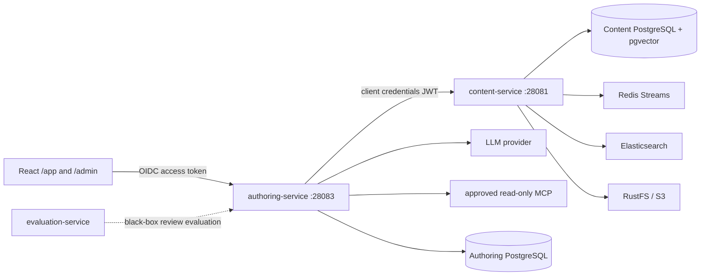

# Engineering Authoring Coach

Engineering Authoring Coach is a course-scoped writing and assessment system. Students create structured engineering artifacts, freeze immutable revisions, and receive evidence-grounded formative reviews. The coach asks reflective questions and proposes revision strategies; it does not write a replacement draft or reveal an MCQ answer.

## Architecture


```mermaid
flowchart LR
    UI[React /app and /admin] -->|OIDC access token| A[authoring-service :28083]
    A -->|client credentials JWT| C[content-service :28081]
    A --> LLM[LLM provider]
    A --> MCP[approved read-only MCP]
    A --> AP[(Authoring PostgreSQL)]
    C --> CP[(Content PostgreSQL + pgvector)]
    C --> RS[Redis Streams]
    C --> ES[Elasticsearch]
    C --> S3[RustFS / S3]
    E[evaluation-service] -. black-box review evaluation .-> A
```

The browser never calls `content-service`. `authoring-service` owns identity, course and project data, immutable revisions, domain-specific Learning Context projections, review orchestration, configuration, audit, and the administrator facade. `content-service` owns course material ingestion and single-course hybrid retrieval and accepts only course-semantic internal requests.

Reviews search the active course first. Only when its evidence is insufficient does Authoring expand through administrator-approved related-course, program, and school scopes. Weighted RRF and per-tier quotas keep the active course dominant; related-course material is explicitly `SUPPLEMENTAL` and cannot independently support technical-accuracy or MCQ-correctness scores.

## Modules

| Module | Responsibility |
| --- | --- |
| `authoring-service/` | `/api/v1` student API, `/api/v1/admin`, async review workers, StateGraph, model snapshots, MCP, audit |
| `content-service/` | `/internal/v1/courses/{courseId}` material lifecycle and hybrid search |
| `frontend/` | English React application split into `/app` and `/admin`, OIDC Authorization Code + PKCE |
| `evaluation-service/` | Async review black-box client and offline authoring metrics with optional RAGAS |

The root Maven reactor intentionally contains only the two production Java services.

## Local setup

1. Copy `.env.example` to `.env` and provide non-default secrets plus OIDC configuration.
2. Run `docker compose up -d` to create fresh infrastructure. PostgreSQL creates the two empty databases explicitly; Flyway owns every application table.
3. Run `mvn -pl content-service spring-boot:run` and `mvn -pl authoring-service spring-boot:run`.
4. Run `cd frontend && npm install && npm run dev`.

This repository does not migrate legacy business data. Back up any old database before manually removing its volume; neither service drops old databases or performs runtime DDL.

## Verification

```bash
mvn verify
cd frontend && npm run lint && npm run build && npm run test
cd evaluation-service && python -m pytest
```

Contracts are maintained in [`docs/contracts`](docs/contracts/README.md). Environment and deployment boundaries are summarized in [MODULES.md](MODULES.md).
